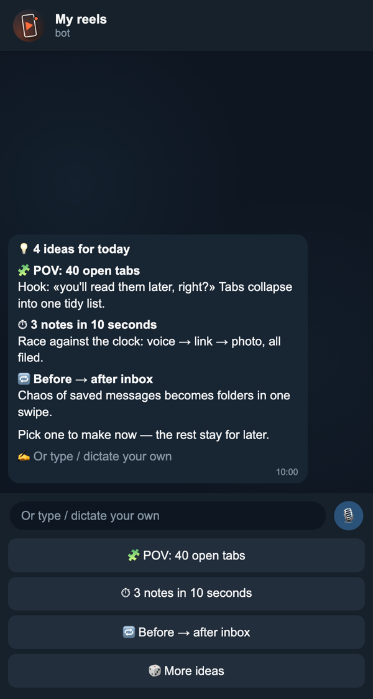
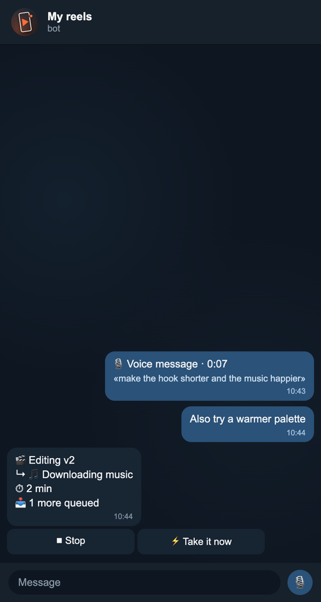
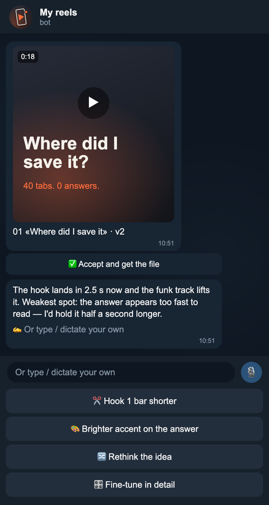
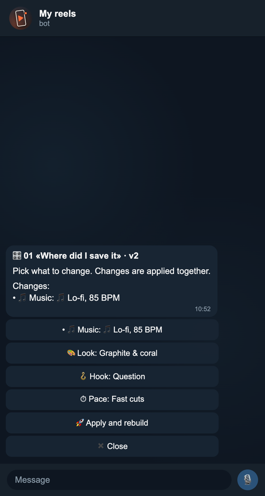

# reels-bot

A Telegram bot that makes reels with **your own coding agent** — Claude Code or Codex. Runs on macOS, Linux and Windows.

Every morning it pitches 4 ideas. Pick one, and it either makes the whole reel itself or walks you through look and music step by step, edits the video in [Remotion](https://www.remotion.dev) and sends it to the chat. After each version comes its honest review with suggested edits as buttons: tap one, open a fine-tune menu, ask it to rethink the idea, or just reply with your own edits by text or voice. **✅ Accept** sends the full-quality file. The bot speaks Russian or English.

<p align="center">
  
  
  
  
</p>
<p align="center"><sub>Ideas · live progress · a version with review and edits · fine-tune menu (UI mock-ups with demo content)</sub></p>

## Install in one message

Send this to your agent (Claude Code, Codex, …):

> Install a reels bot for me: https://github.com/fivol/reels-bot — follow SETUP.md.

The only requirement is Node 22+ (the agent installs it if missing, without admin rights); no git, Homebrew, Python or ffmpeg needed. It installs everything and asks you for one thing: to create a bot in [@BotFather](https://t.me/BotFather) and paste its reply. No files to edit, no terminal.

Manual install: the same steps, by hand, are in [SETUP.md](SETUP.md). Later, to change, stop, move or remove the bot, just ask the same agent ([MANAGE.md](MANAGE.md)).

## How it works

- **You choose, it does the rest.** For ideas, look, music and edits the bot offers its own options as buttons, and anything you write instead wins: your idea, a track link, a reference video.
- **Fast or step by step.** After you pick an idea, choose «🚀 make it now» (the agent decides everything) or «🎛 set up step by step» (look, music and the key choices as button menus; «do the rest yourself» on every step).
- **Live progress.** One message shows the stage and what the agent is doing right now in plain words (🎵 downloading music, 🎬 rendering 40%) and how long it has been at it, with **⏹ Stop** and **⚡ Take it now** buttons. Messages sent mid-task are queued (👀) and go in together; «take it now» interrupts the agent and hands them over at once.
- **Send it anything.** Photos, videos, GIFs, stickers, files, links, forwards from channels — the agent sees all of it, albums and follow-ups arrive together, and everything you ever sent is kept in a history file it can look back at.
- **Limits without nagging.** A quiet note when the agent's 5-hour or weekly limit passes 80%, a loud one at 95% (with how many reels are left), one line after you accept a reel on what it took, and `/usage` any time.
- **Keeps working.** Every network call has a deadline and transient Telegram errors are retried; watchdogs restart the bot if it stalls (e.g. after the laptop slept) or stop an agent that hung, and say so. Nothing gets lost on a crash: the message in progress, the queue and an unsent answer are on disk and picked up after the restart. `npm test` runs these scenarios against a fake Telegram.
- **Clear errors.** Plan limit used up, not logged in, network down, outdated agent — the bot says so in plain words with the raw error and a **🔁 Retry** button. Files over Telegram's limits are compressed to fit (sending) or explained (receiving over 20 MB).
- **Talk by voice.** Dictate ideas, answers and edits as voice messages; they are transcribed locally with Whisper, no API keys.
- **Memory in files, not in the chat.** Your brief, ideas backlog, taste playbook and every reel's history live in `studio/`. The agent session is just a cache: when it grows too big, too long or goes stale, the agent writes a handoff note and a fresh session continues from it. `/new` does the same on demand.
- **Runs on your computer.** It works while the computer is on; on the charger it can keep the computer from falling asleep (one tap at setup or in `/settings`, no system settings changed).
- **Updates on your say-so.** Every 6 hours (or on `/update`) the bot checks this repo; when there is a new version it shows what changed and an **⬆️ Update** button. Nothing is installed without the tap. Your material in `studio/` is never touched; if you changed the bot locally, the agent merges.
- **It learns your taste.** General feedback («hook shorter than 4 s», «no shaking camera») goes into `studio/PLAYBOOK.md` and applies to every next reel.

Commands: `/ideas` — ideas now, `/unfinished` — get back to an unfinished reel, `/settings` — when ideas arrive (time, days, off) and other switches, `/update` — check for a new version now, `/usage` — plan limits and what a reel takes, `/stop` — stop the current task, `/new` — fresh agent session.

## Layout

```
bot/          Telegram ↔ agent bridge (Node 22, no dependencies)
REELS.md      the workflow the agent follows
template/     Remotion starter copied into every reel
scripts/      new reel, render (foreground or background) with progress, loudness, beat grid
test/         npm test — self-check, also run in CI on macOS, Linux and Windows
starter/      seeds studio/ on first run
studio/       yours: brief, ideas, playbook, reels/  (gitignored)
data/         bot state, inbox, logs                 (gitignored)
```

Change settings in `/settings` or just by asking the bot («send ideas at 9», «stop sending ideas»). Technical settings — agent, model, session limits, speech model — are written by the installing agent into `.env` (see [.env.example](.env.example)).

## Good to know

- **Who it talks to.** Only its owner: the installer gives you a personal link to the bot, and opening it makes the bot yours (or it asks «is this you?» on your computer). Everyone else gets a one-line «this is a personal bot». Private chats only — added to a group, it leaves.
- **Safety.** Only you control it: the agent acts on your messages only, outside its folder only where you allow, never publishes anything, and updates only on your tap. Exactly what the code does — network, processes, files — is listed in [SECURITY.md](SECURITY.md); the installing agent checks it and explains it to you before installing.
- **Cost.** It uses your agent's subscription or API account. A reel with a few revisions is a handful of long agent turns.
- **Remotion license.** Free for individuals and companies of up to 3 people; larger companies need a [company license](https://www.remotion.dev/license).
- **Music.** The agent suggests royalty-free tracks (e.g. Mixkit). Check the license of anything you bring yourself.

MIT License.
